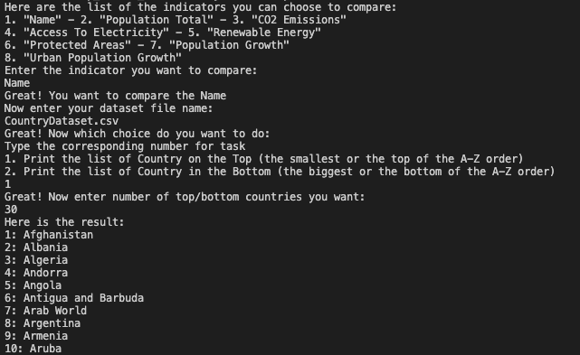

# Using Java to contruct Python libraries

## Overview

While Python is famous for data analyzing, with many tools and libraries. Many of library contains built-in modules written in C. In this project, I recreated those libraries from scratch for users to understand how these libraries actually works through Comparable Class, Double Linked Listed, Hashmap,...

We use the "CountryDatase" for a sample

## Usage
```
$ javac *.java
$ java CountrySorterList
```

The program will display the list of indicators then ask for the indicator user want:
```
Here are the list of the indicators you can choose to compare:
1. "Name" - 2. "Population Total" - 3. "CO2 Emissions"
4. "Access To Electricity" - 5. "Renewable Energy"
6. "Protected Areas" - 7. "Population Growth"
8. "Urban Population Growth"
Enter the indicator you want to compare:
```
The program will make sure user input correctly. If user's input is incorrect, it will ask the user to input again. If user's input is correct, it will confirm it and ask for the data file name. For example:

```
Enter the indicator you want to compare:
$ hello
Your input is not in the list. Do it again!
Enter the indicator you want to compare:
$ Population Total
Great! You want to compare the Population Total
Now enter your dataset file name:
```

Then, make sure you enter the file name correctly. After that, the program will ask for the task user want to do:
```
Now enter your dataset file name:
$ CountryDataset.csv
Great! Now which choice do you want to do: 
Type the corresponding number for task 
1. Print the list of Country on the Top (the smallest or the top of the A-Z order)
2. Print the list of Country in the Bottom (the biggest or the bottom of the A-Z order
```

The program will make sure user input correctly. If user's input is incorrect, it will ask the user to input again. If user's input is correct, it will confirm it and ask for the data file name. It works the same like how it make sure user input the correct indicator. This is a piece of code that makes sure user's input is correct:
```java
System.out.println("Great! Now which choice do you want to do: ");
      String userChoice = "";
      while (true){
        System.out.println("Type the corresponding number for task ");
        System.out.println("1. Print the list of Country on the Top (the smallest or the top of the A-Z order)");
        System.out.println("2. Print the list of Country in the Bottom (the biggest or the bottom of the A-Z order)");
        userChoice = myObj.nextLine();
        if (userChoice.equals("1") || userChoice.equals("2")){
          break;
        }
        else{
          System.out.println("Enter only \"1\" or \"2\". Do it again!");
        }
      }
```

The the program will ask for the number of top/bottom countries users want to print. It wil make sure that user's input is correct. It works the same like how it make sure user input the correct indicator. This is a piece of code that makes sure user's input is correct:

```java
while(true){
        System.out.println("Great! Now enter number of top/bottom countries you want: ");
        userNum = myObj.nextLine();
        
        if (!isInteger(userNum)){
          System.out.println("Only enter number between 1 and " + String.valueOf(countryList.numberOfEntries));
          continue;
        }
        userNumInt = Integer.parseInt(userNum);
        if (userNumInt > countryList.numberOfEntries || userNumInt <= 0){
          System.out.println("Only enter number between 1 and " + String.valueOf(countryList.numberOfEntries));
        }
        else{
          break;
        }
      }
```

Then the program will print the result. For example, if we want to print the top 10 objects on the top of the lists with the indicator is `Population Total`, from the file `CountryDataset.csv`:
```
1: Tuvalu
2: Palau
3: Gibraltar
4: British Virgin Islands
5: Turks and Caicos Islands
6: Sint Maarten (Dutch part)
7: Liechtenstein
8: St. Kitts and Nevis
9: Faroe Islands
10: Marshall Islands
```


## Notice
We use the CountryComparator class instead of having Country implement the interface Comparable. Because using CountryComparator will be much more organized. We don't want to have Country class implement Comparable because at some case Country object don't need to use the Comparable interface. 
Therefore, we implement the Comparable in CountryComparator and only use it when we need to compare. This will make the program simple and organized.


### User can get list of top X countries for each indicator

Our program can get the list of top X countries for each indicator by going a for loop and move the `currentNode` to the `currentNode.next`. This is a piece of the code:
```java
    public String listTop(int topNumber){
      String top = "";
      Node currentNode = firstNode;
      for (int i = 0; i< topNumber; i++){
        top += String.valueOf(i+1);
        top += ": ";
        top += currentNode.data.getName();
        top += "\n";
        currentNode = currentNode.next;
      }
      return top;
    }
```

### User can get list of bottom X countries for each indicator
Our program can get the list of bottom X countries for each indicator by going a for loop and move the `currentNode` to the `currentNode.previous`. This is a piece of the code:
```java
public String listBottom (int bottomNumber){
      String bottom = "";
      Node currentNode = lastNode;
      for (int i = 0; i< bottomNumber; i++){
        bottom += String.valueOf(i+1);
        bottom += ": ";
        bottom += currentNode.data.getName();
        bottom += "\n";
        currentNode = currentNode.previous;
      }
      return bottom;
    }
```

### Information from end of list retrieved efficiently
We can retrieve information from the end efficiently because:
- we have the `lastNode` to keep track of the item at the end of the list
- we have the double-linked list

This is the piece of code, showing how we keep track of the `lastNode`:
```java
    public boolean add(Country newEntry){
      boolean canAdd = false;
      Node newNode = new Node(newEntry);
      Node nodeBefore = getNodeBefore(newEntry);
      if (this.isEmpty() || (nodeBefore == null)){
        newNode.next = firstNode;
        firstNode = newNode;
        lastNode = newNode;
        newNode.previous = null;
        canAdd = true;
      }
      else if(nodeBefore.next == null){
        nodeBefore.next = newNode;
        newNode.previous = nodeBefore;
        lastNode = newNode;
      }
      else{
        Node nodeAfter = nodeBefore.next;
        newNode.next = nodeAfter;
        nodeBefore.next = newNode;
        nodeAfter.previous = newNode;
        newNode.previous = nodeBefore;
        canAdd = true;
      }
      numberOfEntries++;
      return canAdd;
    }
```

This is the piece of code, show how we use double-linked list and `lastNode` to retrieve the item from the end and also from the node after:
```java 
    public String listBottom (int bottomNumber){
      String bottom = "";
      Node currentNode = lastNode;
      for (int i = 0; i< bottomNumber; i++){
        bottom += String.valueOf(i+1);
        bottom += ": ";
        bottom += currentNode.data.getName();
        bottom += "\n";
        currentNode = currentNode.previous;
      }
      return bottom;
    }
```

### `CountryComparator` implemented and used correctly

This is a piece of code of the `compare` method to compare indicators of 2 `Country` objects
```java
    public int compare(Country country1, Country country2) {
        if(!this.indicator.equals("Name")){
            if(country1.getStat(indicator) > country2.getStat(indicator)){
                return 1;
            }
            else if (country1.getStat(indicator) < country2.getStat(indicator)){
                return -1;
            }
            else{
                return 0;
            }
        }
        else{
            int compareInt = (country1.getName().compareToIgnoreCase(country2.getName()));
            if (compareInt < 0 ){
                return -1;
            }
            else if (compareInt > 0){
                return 1;
            }
            else{
                return 0;
            }
        }
    }

```

This is a piece of code when we use the `CountryComparator` in the `getNodeBefore`:
```java
    public Node getNodeBefore(Country wantAddCountry){
      Node currentNode = firstNode;
      Node nodeBefore = null;
      CountryComparator compareTemp = new CountryComparator(this.indicator);
      while (currentNode!= null && (compareTemp.compare(wantAddCountry, currentNode.data) >0)){
        nodeBefore = currentNode;
        currentNode = currentNode.next;
      }
      return nodeBefore;
    }
```

This is the Demo


